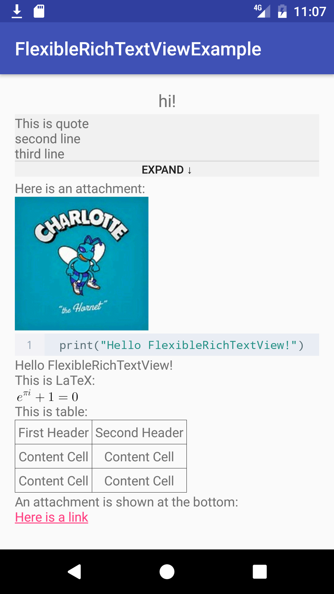

# FlexibleRichTextView

## 简介

一个可以自行定义大部分标签（比如你可以自己定义粗体为 `<b></b>` 或者 `[bold][/bold]` 等等），支持LaTeX、图片、代码高亮、表格、引用以及许多文本样式如粗体、斜体、居中、删除线、下划线等的库。

这个库的一个典型的应用场景为，后端传来带样式的文本，比如粗体：`<b>这是粗体</b>`，只需要使用这个库，设置粗体标签为`<b>`以及`</b>`，就可以直接解析并且显示。

这个库使用 [CodeView](https://github.com/Softwee/codeview-android) 实现代码高亮，使用 [JLaTeXMath](https://github.com/mksmbrtsh/jlatexmath-android) 以及 [它的这个 fork](https://github.com/sixgodIT/JLaTexMath-andriod) 实现渲染 LaTeX。（见 [issue](https://github.com/daquexian/FlexibleRichTextView/issues/1)）

这个库解析文本的方法类似于递归下降，但不是通过自动机而是直接用正则实现词法分析。欢迎有兴趣的小伙伴一起提交 PR 完善这个库。

截图：




## 下载

在项目根目录的`build.gralde`文件里添加：
```
allprojects {
    repositories {
        ...
        maven { url "https://jitpack.io" }
    }
}
```
在`app`的 `build.gradle`文件中添加
```
compile 'com.github.daquexian:FlexibleRichTextView:0.8.1'
```

## 使用

使用之前必须初始化 JLaTeXMath，在 Application 或其他地方添加
```
AjLatexMath.init(context); // init library: load fonts, create paint, etc.
```
如果希望自动识别代码段中的语言以实现高亮，在 Application 或其他地方添加
```
// train classifier on app start
CodeProcessor.init(this);
```
要显示富文本，只需要调用 `flexibleRichTextView.setText(String text)` 方法，例如
```
String richText = "[h][center]hi![/center][/h]" +
                "[quote]This is quote[/quote]" +
                "[code]print(\"Hello FlexibleRichTextView!\")[/code]" +
                "Hello FlexibleRichTextView!\n" +
                "This is LaTeX:\n" +
                "$e^{\\pi i} - 1 = 0$";
flexibleRichTextView.setText(richText);
```

## 标签

在 [这里](https://github.com/daquexian/FlexibleRichTextView/blob/master/library/src/main/java/com/daquexian/flexiblerichtextview/Parser4.java#L711) 查看默认标签。要自定义标签，请使用 `set***Labels` 方法，如 `setBoldStartLabels("<b>", "[b]")`。

在标签中，有一些有特殊含义的字符：
* 在图片标签中，`\w`代表图片显示的宽度，`\h`代表图片显示的高度（如果不指定则会按照图片的原大小显示），`\u`代表图片的 URL

* 在附件标签中，`\s`代表附件的 id

* 在颜色标签中，`\s`代表颜色的字面量（比如 red）

* 在 URL 标签中，`\s`代表 URL

* 在引用标签中，`\p`代表被引用内容的 id，`\m`代表被引用的人的 id

例如，你可以把图片标签自定义为 `\u</img>`，此后，`https://example.img</img>`就会被识别为一个 URL 为 https://example.img 的图片，并且显示在大小为 100 * 200 的 ImageView 中。

## 附件

如果有附件要显示，请创建一个`Attachment`的子类，并且调用`flexibleRichTextView.setText(String richText, List<Attachment> attachments)`方法。

如果 `attachment.isImage()` 为 true，附件将被显示为一个图片，否则将显示为一个链接，点击链接时会调用`OnAttClick`回调方法（详见 [Callbacks](#callbacks)）。

`Attachment`类的其他方法有：返回值为图片 URL 的方法 `getUrl()`、返回值为链接的文本的方法`getText()`、返回值为附件 id 的方法`getAttachmentId()`。

附件会被显示在所有文本的最底部，如果想将附件嵌入在文本中，请实现 `getAttachmentId()`方法并且在附件标签中给出相应的 id。

例如，默认的附件标签为`[attachment:\s]`，其中`\s`是 attachment id。若有以下代码：
```
String textWithAttachment = "This is an attachment\n" +
                            "[attachment:3918dbe1ac]\n" +
                            "The attachment is above";
flexibleRichTextView.setText(textWithAttachment, attachmentList);
```
并且 `attachmentList` 中含有 id 为 `3918dbe1ac` 的附件，则该附件就会显示在这个附件标签的位置。

## 引用

对于引用，除了可以自定义它的标签之外，也可以自行制定引用框的 layout。

默认的引用框的 layout 为 [这个](https://github.com/daquexian/FlexibleRichTextView/blob/master/library/src/main/res/layout/default_quote_view.xml)

使用 `FlexibleRichTextView` 的 `setQuoteViewId` 方法指定 layout 的 id。

被指定的 layout 的根元素必须是一个 `QuoteView`，它的第一个子元素一定要是一个 `FrameLayout`。并且你可以指定一个有着使引用内容“收起”，“展开”功能的按钮，在 xml 里给 `QuoteView` 指定 `app:buttonId` 属性即可。被指定的按钮触发点击事件时，除了会使引用文本展开/收起，`OnViewListener`的`onButtonClick(View view, boolean collpased)`回调方法也会被调用，你可以在这里改变按钮的文本、背景图片等等。

## LaTeX

在[这里](https://github.com/daquexian/FlexibleRichTextView/blob/master/library/src/main/java/com/daquexian/flexiblerichtextview/Tokenizer.java#L339)查看所有 LaTeX 标签，这些标签暂时还不能自定义。

## 表格

表格的语法和 [Github](https://help.github.com/articles/organizing-information-with-tables/) 的相同，唯一的区别是每行两端的 `|` 符号不能省略。

## 回调方法

在 `FlexibleRichTextView.OnViewClickListener` 中，有三个回调方法，分别是 `OnImgClick(ImageView imageView)`、 `OnAttClick(Attachment attachment)` 以及 `OnQuoteButtonClick(View view, boolean collapsed)`。

特别要注意的是，当附件以图片形式显示时，点击附件会引发 `OnImgClick` 事件，当附件以链接形式显示时，才会引发 `OnAttClick` 事件。

## 开源协议

本第三方库使用 Apache 2.0 协议，协议全文见 [LICENSE](https://github.com/daquexian/FlexibleRichTextView/blob/master/LICENSE) 文件。